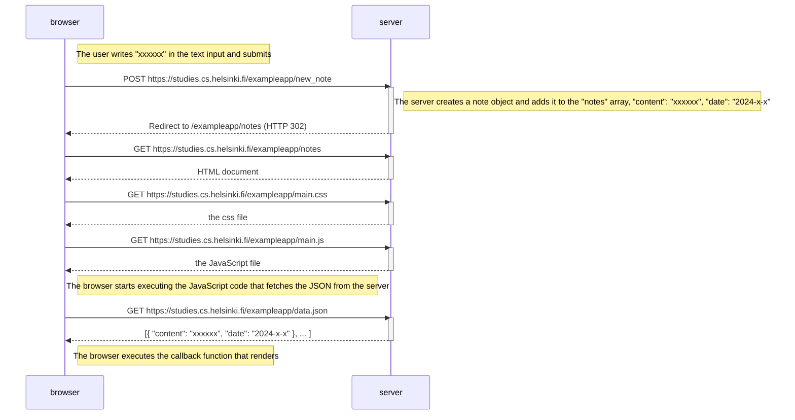

```mermaid

sequenceDiagram
    participant browser
    participant server

    Note right of browser: The user writes "xxxxxx" in the text input and submits

    browser->>server: POST https://studies.cs.helsinki.fi/exampleapp/new_note
    activate server
    
    Note right of server: The server creates a note object and adds it to the "notes" array, "content": "xxxxxx", "date": "2024-x-x"

    server-->>browser: Redirect to /exampleapp/notes (HTTP 302)
    deactivate server

    browser->>server: GET https://studies.cs.helsinki.fi/exampleapp/notes
    activate server
    server-->>browser: HTML document
    deactivate server

    browser->>server: GET https://studies.cs.helsinki.fi/exampleapp/main.css
    activate server
    server-->>browser: the css file
    deactivate server

    browser->>server: GET https://studies.cs.helsinki.fi/exampleapp/main.js
    activate server
    server-->>browser: the JavaScript file
    deactivate server

    Note right of browser: The browser starts executing the JavaScript code that fetches the JSON from the server

    browser->>server: GET https://studies.cs.helsinki.fi/exampleapp/data.json
    activate server
    server-->>browser: [{ "content": "xxxxxx", "date": "2024-x-x" }, ... ]
    deactivate server

    Note right of browser: The browser executes the callback function that renders

```